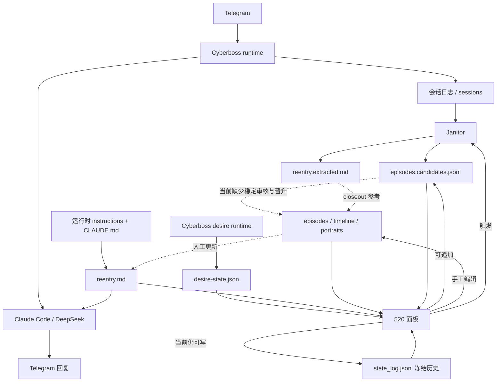

# 记忆系统与 520 面板：结构图、真实状态与修复顺序

> 最后更新：2026-07-10  
> 这份文档专门回答四个问题：
>
> 1. 现在到底有几套“记忆”；
> 2. 哪些链路真的跑通过；
> 3. 哪些只是有代码、有页面或有 Markdown；
> 4. 520 面板现在到底在读什么、写什么、哪里有冲突。

相关总览：[`PROJECT_OVERVIEW.md`](./PROJECT_OVERVIEW.md)

---

## 0. 先看一句话结论

现在不是“记忆系统完全没做”，也不是“整套已经完成”。真实情况是：

```text
已跑通：
Telegram → Cyberboss → Claude Code → DeepSeek
会话日志 → Janitor → candidates / reentry.extracted
520 面板启动、查看文件、时间线、健康度、手动触发 Janitor

已实现但没收敛：
TG 启动时读取 reentry
记忆 on/off 与 prompt 同步
520 的八维、配置、写接口
Windows 启动与 watchdog

只有半条链或 Markdown：
candidates → 审核 → canon
每日 closeout 自动触发
证据链
memory-vault 流转
关怀和剧场的完整产品逻辑

有明确冲突或 bug：
TG state-dir 可能写错
main 中 prompt 模板路径仍沿用旧目录结构
旧 Cyberboss memory 默认可能继续后台写
reentry 设计预算 300 字，但面板仍按 800 字
state_log 已宣布冻结，但面板仍能追加写入
面板文档说“只是外显”，实际却能改记忆、改配置、写 state_log
```

因此，下一版不该继续加功能。先把“哪套数据是谁写、谁读、谁有权改”收成一条清楚的主线。

---

## 1. 状态标记

| 标记 | 含义 |
|---|---|
| ✅ 已跑通 | 本地实际运行过，或已有明确测试记录 |
| 🟢 已收敛 | 设计边界已经确定，后续不应反复推翻 |
| 🟡 半成品 | 有代码、曾可用，但接线、路径或边界仍不稳定 |
| 🐛 有 bug / 冲突 | 已发现明确矛盾或错误路径 |
| 🧱 只有外壳 | 有页面、模板、接口或文件，但完整闭环没接通 |
| 📝 仅 Markdown | 目前主要是设计说明或人工流程，没有自动运行链 |
| ⬜ 未实现 | 只有计划 |
| 🗑 已放弃 | 不应继续带回新主线 |

---

## 2. 系统现在分成五层

### 2.1 白话结构图

```text
┌─────────────────────────────────────────────────────────┐
│ ① 对话运行层                                             │
│ Telegram → Cyberboss → Claude Code → DeepSeek → 回复     │
│                         │                                │
│                         └→ conversations / session logs  │
└─────────────────────────────────────────────────────────┘
                           │
                           ▼
┌─────────────────────────────────────────────────────────┐
│ ② 关系记忆层 memory/                                     │
│ reentry    醒来时的一小口                                │
│ episodes   证据层                                        │
│ timeline   关系故事层                                    │
│ portraits  她与我的长期理解                              │
│ home / closeout_guide  运转说明与人工整理模板             │
└─────────────────────────────────────────────────────────┘
                           ▲
                           │ 人工/AI closeout（当前未闭环）
                           │
┌─────────────────────────────────────────────────────────┐
│ ③ 候选提取层 memory-kit                                  │
│ conversations → Janitor → episodes.candidates.jsonl      │
│                         └→ reentry.extracted.md           │
│ 自动只写候选，不应直接写 canon                            │
└─────────────────────────────────────────────────────────┘

┌─────────────────────────────────────────────────────────┐
│ ④ Cyberboss desire 状态层                                │
│ desire runtime → desire-state.json                       │
│ 旧 state_log.jsonl 按 v2.1 设计应冻结                     │
└─────────────────────────────────────────────────────────┘
                           ▲
                           │ 读取/展示，同时仍存在旧写入口
                           │
┌─────────────────────────────────────────────────────────┐
│ ⑤ 520 面板                                               │
│ 读：reentry / timeline / episodes / candidates / desire  │
│ 写：文件编辑、candidate、state_log、配置、care 数据       │
│ 动作：启动 Janitor                                       │
└─────────────────────────────────────────────────────────┘
```

### 2.2 Mermaid 图



图里的虚线就是“现在没有完整自动闭环”的地方。

---

## 3. 已跑通的链路

## 3.1 对话回复链 — ✅ 已跑通（legacy）/ 🟡 main 未验证

```text
Telegram
→ Cyberboss poller
→ Claude Code runtime
→ DeepSeek Anthropic-compatible endpoint
→ Telegram 回复
```

结论：

- 这条链在本地 `legacy-current` 曾经实际运行；
- GitHub `main` 保留了上游核心，但尚未在全新目录做完整 smoke test；
- 未来应从 `main` 重新验证，而不是继续在 legacy 上堆补丁。

## 3.2 Janitor 候选提取链 — ✅ 已实现并测试

```text
Claude/Cyberboss 会话 JSONL
→ Janitor 扫描新增行
→ 按位点和内容哈希去重
→ 调用提取模型
→ 追加 episodes.candidates.jsonl
→ 覆盖 reentry.extracted.md
```

已经具备：

- `--dry-run`，不调 API、不写文件；
- `.janitor_state.json` 位点；
- `.cache/janitor_*.json` 内容缓存；
- 失败块不推进位点，下次可重试；
- candidate 使用 `cand-` 前缀；
- 自动流程不会直接写正式 episodes；
- 已有 18/18 测试通过记录。

尚未收敛：

- 默认输入目录仍是本机硬编码路径；
- 正式运行需要 API key；
- 520 启动后默认每 6 小时自动跑一次 Janitor，这个行为目前不够显式；
- Janitor 产出候选之后，没有稳定的审核和晋升流程。

## 3.3 520 基础查看链 — ✅ 已跑通 / 🟡 部分数据源未统一

```text
python dashboard.py
→ 127.0.0.1:520
→ 健康度 / 注入概览 / 记忆地图 / 时间线 / 八维 / 文件
```

已实现：

- 只绑定本机 `127.0.0.1`；
- 健康度检查；
- timeline 展示；
- episode 与 JSONL 卡片展示；
- 文件编辑前 diff；
- 保存前自动备份；
- Janitor 状态展示和手动触发；
- 20 秒自动刷新；
- 写接口使用本地 API token。

问题：

- “能打开页面”不等于“数据模型已经统一”；
- 八维页同时面对 `state_log.jsonl` 历史和 `desire-state.json` 实时状态；
- 面板依然保留旧 state_log 写入口；
- 面板同时承担查看器、编辑器、配置页、Janitor 调度器，职责过多。

---

## 4. 记忆读取链：预期、现状与 bug

## 4.1 预期链路

```text
Cyberboss 启动
→ 读取正确 state-dir 下的 weixin-instructions.md
→ 加载 workspace/CLAUDE.md
→ CLAUDE.md 指向 memory/reentry.md
→ 新会话安静接回，不汇报记忆
```

## 4.2 当前状态 — 🟡 + 🐛

`sync_memory_block.py` 和 `memory_toggle.py` 都会在未设置环境变量时默认使用：

```text
~/.cyberboss
```

但 TG 实际运行状态目录是：

```text
~/.cyberboss-deepseek-test
```

这会造成：

```text
你以为同步了 TG prompt
实际可能改到了另一套 state 目录
```

此外，`main` 已把记忆工具移动到：

```text
extensions/relationship-memory/memory-kit/
```

但 `sync_memory_block.py` 仍按旧工作区布局寻找：

```text
<workspace-parent>/cyberboss-deepseek-test/templates/weixin-instructions.md
```

在 GitHub `main` 的新目录结构里，这个相对路径不再天然成立。也就是说：

> legacy 目录里可能能找到模板；从 `main` 全新 clone 后，这个脚本很可能直接找不到模板。

## 4.3 记忆开关 — 🟡 已实现，但容易状态不一致

`memory_toggle.py` 同时修改三处：

```text
workspace/CLAUDE.md
runtime weixin-instructions.md
memory/.disabled 标记
```

优点：能做 A/B 测试。

风险：

- runtime 进程不会被脚本自动刷新，仍需要 `/reread` 或重启；
- state-dir 可能选错；
- `CLAUDE.md.memory-on.bak` 与实际当前版本可能产生时间差；
- 任一处修改失败，就会出现“标记是 on，但实际没挂上”或反过来。

首个稳定版本建议：

- 先不做复杂 on/off；
- 只提供一个 `status` 检查；
- state-dir 和模板路径必须显式配置；
- 同步后自动做内容校验，但不自动重启 TG。

---

## 5. 正式记忆链：哪些是真的，哪些只是 Markdown

## 5.1 文件层 — ✅ 已有实际内容与使用记录

| 文件 | 现在的角色 | 状态 |
|---|---|---|
| `reentry.md` | 新窗口第一口连续性 | ✅ 文件和本地使用存在；🟡 prompt 是否总读到最新版未确认 |
| `episodes.jsonl` | 关系事件证据层 | ✅ 本地曾有正式数据 |
| `relationship_timeline.md` | 关系故事层 | ✅ 文件和本地内容存在 |
| `user_portrait.md` | 反复主题与证据式理解 | ✅ 文件存在并使用过 |
| `ai_self_portrait.md` | AI 长期自我理解 | ✅ 文件存在；自动更新机制未闭环 |
| `ai_self_notes.md` | 写给未来自己的追加笔记 | ✅ 文件存在；依赖人工/AI 主动写 |
| `home.md` | 运转动机和边界 | 🟢 设计已收敛 |
| `closeout_guide.md` | 每晚三问 | 📝 目前主要是人工模板 |
| `rereadings.md` | 旧事件的新理解 | 🟡 文件位已建，低频人工使用 |
| `state_log.jsonl` | v1 八维历史 | 🟢 设计上冻结；🐛 面板仍可写 |

## 5.2 Closeout 链 — 📝 主要仍是人工流程

现在存在的是：

```text
closeout_guide.md
→ 三问
→ AI/人自己决定是否修改 reentry / episodes / timeline / portraits
```

还不存在稳定的：

```text
每天固定触发
→ 检查当天会话
→ 生成 diff
→ 用户/AI 审核
→ 提交 canon
→ 失败时由 Janitor 补偿
```

因此，“closeout 已经设计好”不等于“closeout 自动化已跑通”。

## 5.3 Candidate → canon — 🧱 只有前半条

已跑通：

```text
conversation logs → Janitor → candidates
```

未跑通：

```text
candidates
→ 去重
→ 合并同一事件
→ 查看原始证据
→ 接受 / 拒绝 / 延后
→ 晋升 episodes
→ 必要时同步 timeline / portrait / reentry
→ 可回滚
```

这是当前记忆系统最大的产品缺口。

---

## 6. Desire 与 state_log：目前为什么混乱

## 6.1 已收敛的设计

v2.1 已经决定：

```text
Cyberboss desire runtime
→ 写当前 desire-state.json

关系记忆层
→ 不再手写八维

memory/state_log.jsonl
→ 只作历史冻结文件
```

## 6.2 当前实现冲突 — 🐛

520 面板仍然：

- 读取 `state_log.jsonl` 作为历史曲线来源；
- 同时读取实时 `desire-state.json`；
- 暴露 `POST /api/state_log`；
- 允许通过 token 继续追加 state_log。

所以实际是：

```text
设计：state_log 冻结
代码：state_log 还能写
```

这会让未来模型误以为两条都是权威来源。

## 6.3 首版应如何收敛

首个稳定版本建议：

1. 禁用 `POST /api/state_log`；
2. 面板清楚标注：
   - `desire-state.json` = 当前实时值；
   - `state_log.jsonl` = 冻结历史，只读；
3. 暂时不做自动 history；
4. 未来需要曲线时，单独做 `desire-history` service，不从对话启动路径回填。

---

## 7. 520 面板到底是什么

现在的 520 不是单纯“展示页”。它实际上同时做了五件事：

```text
① 读记忆
② 编辑记忆文件
③ 触发 Janitor
④ 写 candidate / state_log / care
⑤ 修改模型、key、代理、Telegram 配置并调用 apply_keys_to_env
```

### 7.1 已实现的读能力

| 能力 | 状态 |
|---|---|
| 文件列表与内容读取 | ✅ |
| 健康度 | ✅ / 🟡 指标待校准 |
| 注入概览 | ✅ / 🟡 需和真实 runtime 对照 |
| 记忆地图 | ✅ / 🟡 仍需补证据链 |
| timeline | ✅ |
| episodes / rereadings 索引 | ✅ |
| state rows | ✅ / 🟡 两套状态源 |
| reentry / timeline / episodes API | ✅ |
| care config / cycle 读取 | 🧱 |
| theater scripts 读取 | 🧱 |

### 7.2 已实现的写能力

| 写入口 | 当前行为 | 判断 |
|---|---|---|
| `POST /api/save` | 可编辑 memory 文件，保存前备份 | ✅ 人工工具；首版应限制范围 |
| `POST /api/episode_candidate` | 追加 candidate | ✅ 符合候选/正史分离 |
| `POST /api/janitor/run` | 后台线程启动 Janitor | ✅ / 🟡 需明确失败与费用 |
| `POST /api/state_log` | 追加旧八维日志 | 🐛 与 v2.1 冻结设计冲突 |
| `POST /api/config` | 改 provider、模型、key、代理、TG 配置 | 🟡 功能存在，但不属于“纯面板” |
| `POST /api/care/config` | 保存关怀配置 | 🧱 完整关怀链未接 |
| `POST /api/care/cycle` | 追加周期记录 | 🧱 数据录入有了，行为逻辑未接 |

### 7.3 目前最危险的误解

旧文档说：

```text
面板只是外显，不写关系逻辑
```

这句话只对一半。

面板确实不会自动判断“这段关系意味着什么”，但它已经有能力：

- 编辑正式 memory 文件；
- 写 state_log；
- 写 candidate；
- 修改配置和 token；
- 启动 Janitor。

所以更准确的定义应是：

> 520 是本地的记忆维护控制台，不只是展示页。默认应只读，写操作应进入明确的维护模式。

---

## 8. 目前确认的 bug、冲突和风险

## P0：影响“读到哪套记忆”的问题

### P0-1 state-dir 默认错误 — 🐛

- 工具默认 `~/.cyberboss`；
- TG 实际使用 `~/.cyberboss-deepseek-test`；
- 可能同步到错误运行态。

### P0-2 `main` 的模板相对路径失效 — 🐛

- 脚本仍按旧 cyberlink/workspace 并排结构找模板；
- `main` 已把工具移动到 `extensions/relationship-memory`；
- 全新 clone 后需要新的 repo-root / template-root 解析。

### P0-3 两套 memory 可能同时写 — 🐛

Windows 启动脚本在没有配置时仍默认：

```text
CYBERBOSS_MEMORY_BACKGROUND_WRITE=1
```

这会让 Cyberboss 旧内置 memory 与新关系 memory 同时存在写入可能。

首版应明确设为 `0`。

## P0：影响“哪套数据是权威”的问题

### P0-4 reentry 预算不一致 — 🐛

- v2.1 设计：约 300 字；
- dashboard.py：`REENTRY_BUDGET = 800`。

### P0-5 state_log 冻结但仍能写 — 🐛

- 文档宣布冻结；
- 520 仍暴露写 API。

### P0-6 面板职责与说明不一致 — 🟡 / 🐛

- 文档把它叫“外显”；
- 实际是查看器 + 编辑器 + 配置器 + 调度器。

## P1：可用但不便迁移

### P1-1 Janitor 输入路径硬编码 — 🟡

默认仍指向当前电脑的 Claude 项目目录。换目录、换电脑或从 `main` clone 后需要手工传 `--input`。

### P1-2 面板启动即默认开启自动 Janitor — 🟡

- 缺省间隔为 6 小时；
- 面板启动时创建后台线程；
- 可能在用户只想“看一眼页面”时发生 API 调用。

首版建议默认关闭，只保留“立即补记”按钮。

### P1-3 记忆 on/off 是多文件事务，但没有真正事务保护 — 🟡

中途失败可能产生 CLAUDE.md、runtime prompt、`.disabled` 三者不同步。

### P1-4 dashboard 配置页可改敏感运行配置 — 🟡

本地绑定与 token 降低了风险，但它需要被明确归类为“维护模式”，不能和普通查看页混在一起。

---

## 9. 只有 Markdown / 外壳阶段的功能

| 功能 | 当前拥有 | 当前缺少 | 状态 |
|---|---|---|---|
| 自动 closeout | 三问模板、canon 文件 | 触发、diff、审核、失败补偿 | 📝 / 🧱 |
| Candidate 审核 | candidates 文件、基础编辑器 | 去重、合并、证据、晋升、回滚 | 🧱 |
| 证据链 | episode id 概念 | 原消息 ref、timeline/portrait/reentry 统一引用 | 🧱 |
| memory-vault | candidate/canon 已分开 | inbox/review/archive、软删除、统一工具 | ⬜ |
| 关怀 | 520 页面、配置和周期录入 | 天气、授权、频率、对话集成、安全校验 | 🧱 |
| 剧场 | 模板、索引、只读页面 | 战役运行、NPC 状态、TG 接线、记忆隔离校验 | 🧱 |
| Topic index | 路线图说明 | topics.md 与维护工具 | ⬜ |
| 语义检索 | 设计讨论 | embedding、按需工具、规模测试 | ⬜ |
| 语音转文字 | 设计说明 | Whisper/API、TG 长按或按钮交互 | ⬜ |
| 主动消息 | 边界讨论 | 调度、同意、频率、撤回与静默逻辑 | ⬜ |

---

## 10. 目标结构：收敛后应该长这样

```text
┌──────────────── 对话运行层 ────────────────┐
│ 上游 Cyberboss + 最小 Windows 兼容         │
│ 不内置关系记忆逻辑，不做末端去重补丁       │
└────────────────────────────────────────────┘
                    │
                    ▼
┌──────────────── 关系记忆插件 ──────────────┐
│ 热路径：reentry                            │
│ 温路径：timeline / episodes / portraits    │
│ 冷路径：home / closeout guide              │
│ canon 只有审核后才能写                     │
└────────────────────────────────────────────┘
                    ▲
                    │
┌──────────────── 候选维护层 ────────────────┐
│ Janitor 手动/明确调度                       │
│ logs → candidates                          │
│ review → canon                             │
│ 每次晋升都有 diff、证据、rollback          │
└────────────────────────────────────────────┘

┌──────────────── Desire 层 ─────────────────┐
│ 当前值：desire-state.json                  │
│ 历史：未来独立 service                     │
│ 不再写旧 state_log                         │
└────────────────────────────────────────────┘

┌──────────────── 520 控制台 ────────────────┐
│ 默认：只读查看                             │
│ 维护模式：编辑 / review / config           │
│ 正史写入必须经过明确确认                   │
└────────────────────────────────────────────┘
```

---

## 11. 修复顺序

## Phase A：先让读取链唯一、正确

- [ ] `sync_memory_block.py` 支持显式 `--state-dir`；
- [ ] 未传 state-dir 时停止，不再默认猜 `.cyberboss`；
- [ ] 修正 `main` 中 template-root / repo-root 定位；
- [ ] `memory_toggle.py` 使用同一配置源；
- [ ] 运行后校验 TG runtime prompt 确实包含 v2 记忆块；
- [ ] 默认 `CYBERBOSS_MEMORY_BACKGROUND_WRITE=0`；
- [ ] 在全新目录验证 TG 只读正确的 reentry。

## Phase B：把 520 先收成“安全只读版”

- [ ] `REENTRY_BUDGET` 改成统一值；
- [ ] 禁用 `POST /api/state_log`；
- [ ] state_log 明确标记“冻结历史”；
- [ ] desire 当前值直接读 `desire-state.json`；
- [ ] 自动 Janitor 默认关闭；
- [ ] 普通模式隐藏 config 和任意文件写入；
- [ ] 维护模式需要明确开启。

## Phase C：补齐候选晋升闭环

- [ ] candidate 列表；
- [ ] 原始证据预览；
- [ ] 去重与事件合并；
- [ ] 接受 / 拒绝 / 延后；
- [ ] 晋升 episodes；
- [ ] 可选同步 timeline / portrait / reentry；
- [ ] 保存前 diff；
- [ ] 一键 rollback。

## Phase D：再做扩展功能

- [ ] desire history；
- [ ] 关怀；
- [ ] 剧场；
- [ ] 语音转文字；
- [ ] topic index；
- [ ] 语义检索；
- [ ] 主动消息。

---

## 12. 每条链路的完成标准

### 12.1 记忆读取完成

- [ ] TG 只使用一个明确 state-dir；
- [ ] runtime prompt 是 v2；
- [ ] 新窗口确实读取指定 reentry；
- [ ] 不读取错误 workspace；
- [ ] 旧 memory 不后台双写；
- [ ] `/new` 和 resume 都能保持预期连续性。

### 12.2 Janitor 完成

- [x] 增量扫描；
- [x] 幂等与缓存；
- [x] 只写 candidate；
- [x] dry-run；
- [ ] 路径可配置；
- [ ] 默认不暗中自动调用 API；
- [ ] 候选能进入审核队列；
- [ ] 失败与费用在面板可见。

### 12.3 Canon 闭环完成

- [ ] 候选有明确状态；
- [ ] 能查看证据；
- [ ] 能合并同一事件；
- [ ] 晋升前可预览 diff；
- [ ] 正式文件不会被自动流程直接写；
- [ ] 每次晋升可追溯、可撤回。

### 12.4 520 完成

- [x] 本地打开；
- [x] 基础查看；
- [x] timeline / 文件展示；
- [x] token 保护写接口；
- [ ] 默认只读；
- [ ] state_log 不再写；
- [ ] desire 数据源唯一；
- [ ] candidate review UI；
- [ ] 普通模式与维护模式分离；
- [ ] 所有页面明确显示“数据来源”和“最后更新时间”。

---

## 13. 当前最小任务

现在不要同时修整个 memory-kit 和 520。

第一条分支只做：

```text
fix/p0-memory-wiring

1. 显式 state-dir
2. 修 template-root
3. 关闭旧 memory 后台写
4. 加 prompt/reentry 自检
5. 不改 Janitor 算法
6. 不改 dashboard 大页面
```

第二条分支再做：

```text
fix/p0-dashboard-readonly

1. 统一 reentry budget
2. 禁用 state_log 写入
3. 自动 Janitor 默认关闭
4. 标明每项数据源
5. 不做 candidate review UI
```

这两条通过 smoke test 后，才进入候选审核闭环。

---

## 14. 给未来模型的判断规则

看到文件或页面时，先问：

```text
它只是存在？
它能单独运行？
它已经接进真实链路？
它在 legacy 跑过，还是 main 也验证过？
它写 candidate，还是会碰 canon？
它的数据源是谁？
失败后会不会静默、双写或自动重启？
```

不要再把以下情况写成“已完成”：

- 有 Markdown = 自动流程完成；
- 有 520 页面 = 产品链路完成；
- 有 API = 数据边界收敛；
- legacy 跑过 = main 可部署；
- 文件存在 = TG 一定读到了它。
